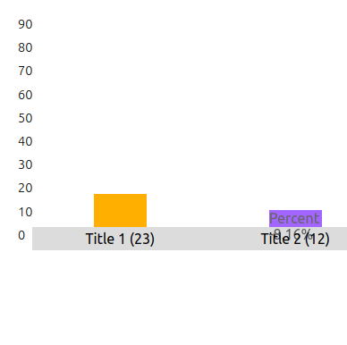

This project was bootstrapped with [Create React App](https://github.com/facebook/create-react-app):

## Build Scripts

- npm start

## Achieved Checklist

- Take data as props

- Take data for X-axis label, colors

- Support Customisation of width

- Hovering shows the Value

- Mobile Friendly

## Missed Checklist

- Y-axis label not taken
Reason - Not able to understand how to add he y labels, as in what exactly would it mean

- Customisation of height not supported
Reason - Not well versed in CSS, still learning it

- Tests not added
Reason - Haven;t learnt how to add tests till now. 

## Further Enhancements
- Make a form to input data

- Choose from multiple types of graphs (Pie Charts)

- Adding tests.

## Problems in the current code
- Some CSS are not done properly

